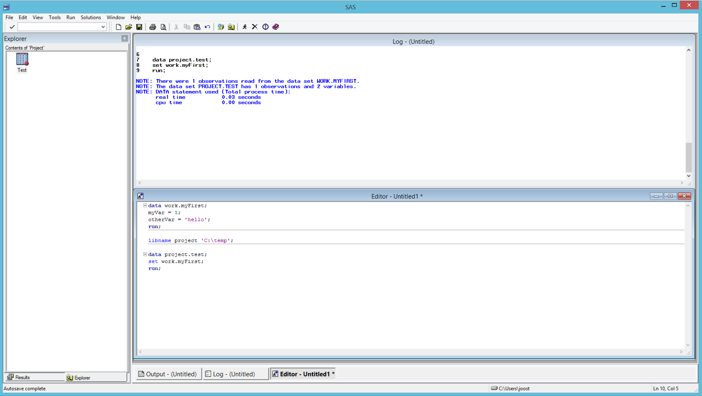
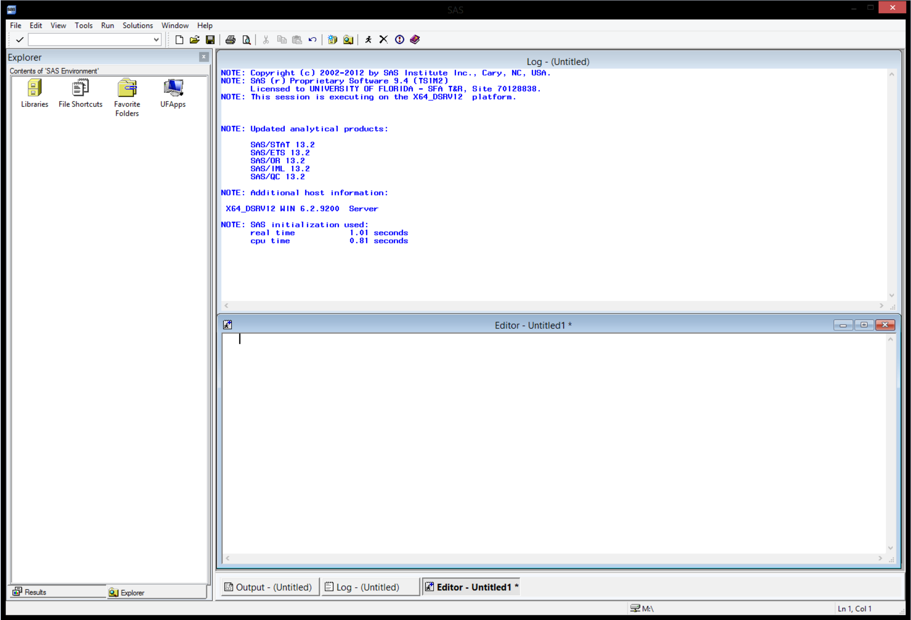
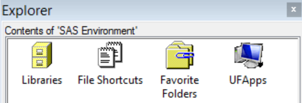
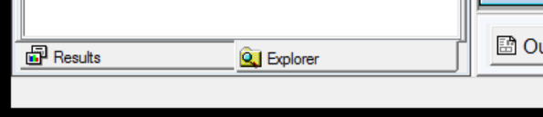
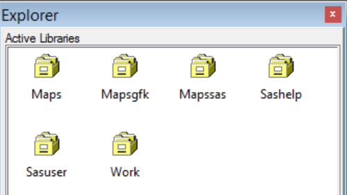
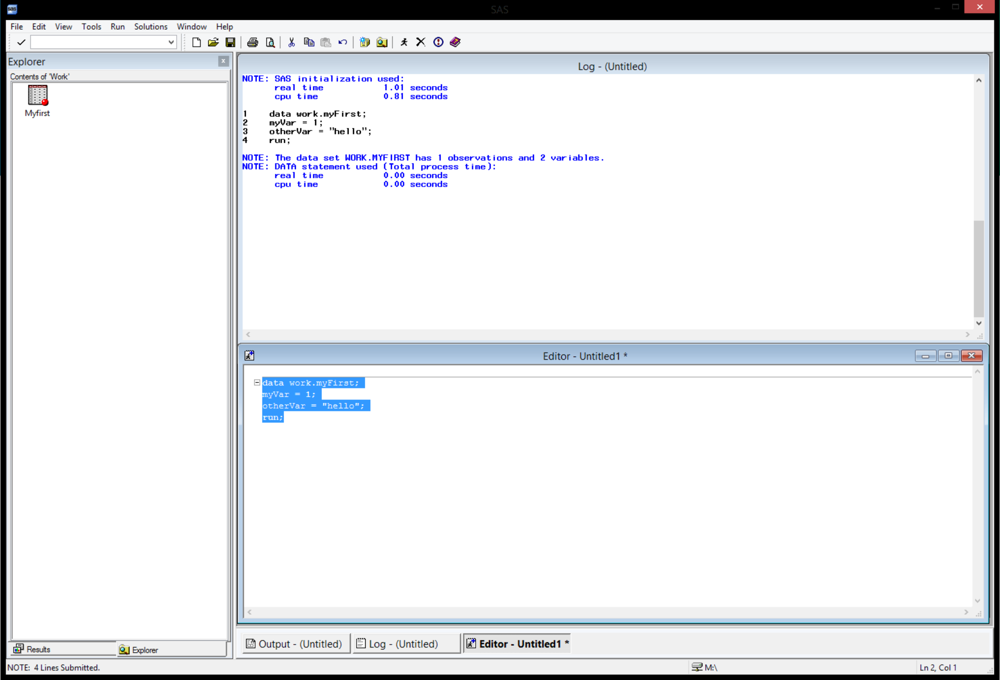
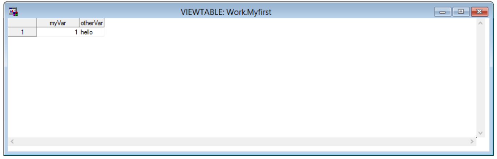
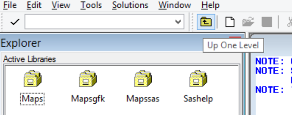
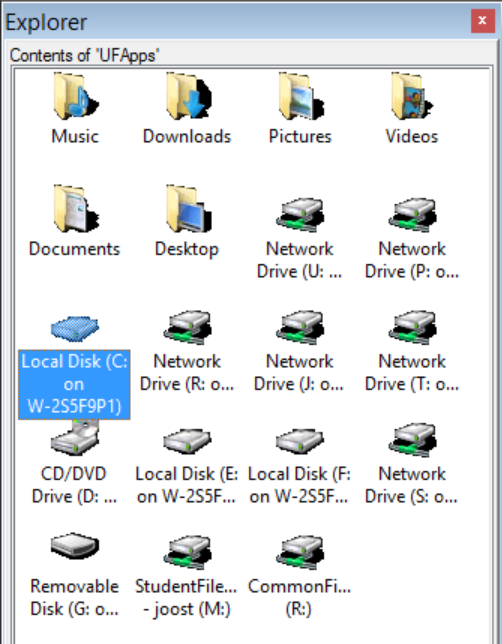
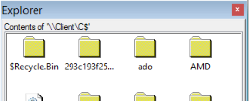

# Using SAS

## Quick overview (Youtube video)

[](http://www.youtube.com/watch?v=Y45yTB6KMZE "SAS create a dataset")

Click the image above to play the video.

## SAS environment

Doubleclick SAS to open it. After startup the interface looks as follows:



### The main windows

There are three main windows/panels in SAS:

- Explorer: in the left panel, used to navigate folders/libraries
- Log: in the middle panel, shows the commands that ran and output
- Editor: middle panel, below; used to edit programs

### Explorer

Use the explorer window to navigate libraries (links to folders), or the available drives (right-most icon is 'This PC' for local installations, in this case 'UFApps' as this screenshot is taken from UF Apps which runs 'in the cloud'):



Notice that this window can also display results (like regression output), in that case, you may need to switch between 'results' and 'explorer' (see bottom of explorer window):



#### Libraries

Libraries are references to folders on the hard disk. Doubleclick 'libraries' to see which libraries are available:



The default library is 'work'. It always exists and is empty on startup. Any datasets in this library are deleted after a session.

The following code creates a new dataset in library (that is a fancy name for 'folder') `work`, and consists of a single record:

```SAS
data work.myFirst;
myVar = 1;
otherVar = "hello";
run;
```
Copy/paste the code to the editor; select the 4 lines. `F3` runs the code.

Notice the explorer and log:



Doubleclick the `myFirst` dataset in the work library to inspect the contents of the dataset:



Note that dataset names are case insensitive; so 'myFirst' and 'myfirst' refer to the same dataset.

To navigate 'up' (back to libraries, or to a parent folder), click the 'up icon':



> Note: if the 'up' icon is not there, you may need to click in the left panel first.

#### Drives

To inspect the drives that are available, navigate up in the explorer, and click 'UF Apps' (4th icon).



Doubleclicking on a drive, for example 'local disk C on W-...', gives the drive content:



> Notice the folder location, '\\\\Client\C$', for local installations of SAS this would most likely be something like 'C:'. 

To make datasets permanent (datasets in 'work' are deleted when the session ends), make a subfolder on 'C:\' (or another local drive), for example 'C:\temp'. When a folder exists, SAS is able to make a library reference to it. (That is, a short name can be used to refer to that folder). For example:

```SAS
libname project "C:\temp";
```

The above statement creates a library which is basically a link to a folder (in this case a link to the 'temp' folder on the local drive). Files in that folder can now be referenced by 'project'. 

The following code makes a copy of 'myFirst' in the 'work' library to 'test' in the 'project' library.  
```SAS
/* make a copy */
data project.test;
set work.myFirst;
run;
```

Verify that a file named 'test.sas7bdat' now exists in your folder (in this case C:\temp).


