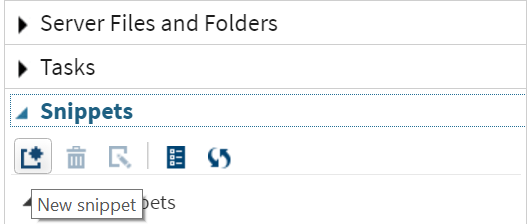
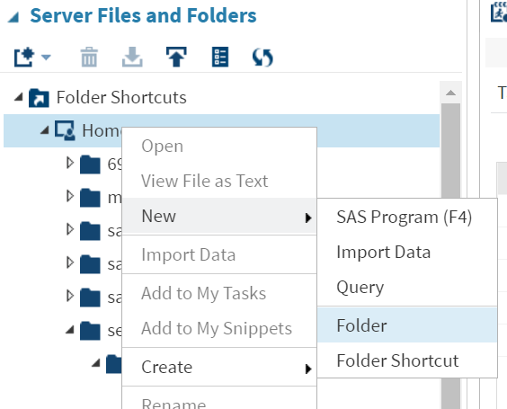

# Using SAS Studio

SAS Studio is an alternative to use SAS, which is hosted on WRDS' servers. As a result, accessing WRDS datasets is very straightforward. The drawback is that SAS Studio requires uploads/downloads to move files between SAS Studio and your pc (UF Apps can access your local drives directly). SAS Studio is helpful to browse WRDS datasets and run 'snippets' of code to help understand the WRDS datasets. 

## Access

You can access SAS Studio with your WRDS account at [wrds-cloud.wharton.upenn.edu/SASStudio](https://wrds-cloud.wharton.upenn.edu/SASStudio/). Use your WRDS credentials to log in. 

## Main options

For our purposes, working with WRDS datasets and running code snippets is the main purpose of SAS Studio.

### Libraries

The left panel, option `Libraries` allows you to navigate the libraries of the different vendors, and view the different datasets.

For example, navigate to 'COMP', and doubleclick 'FUNDA' to inspect this dataset. You can click on column names to see the type (character vs numeric); and toggle the display of columns. 

### Snippets

Since many of the datasets are hard to inspect by scrolling through the rows/columns, it is helpful to write short snippets of code.

Select 'Snippets' in the left panel, and click on the 'new snippet' icon (first icon on the left):



Copy the following code into the snippet editor:

```SAS
data test (keep = gvkey fyear sale at ni);
set comp.funda;
/* only keep records for 2015 */
if fyear eq 2015;
/* assets greater than 0 */
if at > 0;
/* standard filter (otherwise duplicate records) */
if indfmt='INDL' and datafmt='STD' and popsrc='D' and consol='C';
run;
```

This creates a new dataset 'test', which takes `comp.funda` (Compustat Funda) as its input. Only observations for fiscal 2015 will be kept ('eq' stands for equal), and firms with zero or missing assets are dropped. There is also a boilerplate filter (on industry format, data format, population source and consolidation flag). 

The 'keep' statement (`keep = gvkey fyear sale at ni`) lists the variables to keep in the dataset that is created.


Then click the first icon of the code panel ('running' man), or press `F3` to run this code. When done, it will show the output, which can be inspected just like the datasets in 'Libraries':


It is possible to have multiple pieces of code in the same snippet. Add the following code which takes the `test` dataset you just created and computes asset turnover:

```SAS
data test2;
set test;
assturn = sale/at;
run;
```

Select these 4 lines of code and press `F3` to only run the selected lines. 
This creates another dataset 'test2' which takes `test` as its input and adds a column 'at'


### Your home folder on WRDS

The above datasets 'test' and 'test2' are created in a temporary folder (the `work` library, which is the default library). Each WRDS user has a folder where they can permanently store files. It is possible to store datasets in this folder using the snippets (it is also possible with SAS UF Apps).

In SAS Studio, first create a new folder, name it `myProject`. Click 'Server Files and Folders', 'Folder Shortcuts', rightclick 'Home' and select 'New', 'Folder'.



To place files in this folder, you use the `libname` statement to make a library reference to it. Run the following code:

```SAS
libname project '~/myProject';

data project.fundatest;
set test2;
run;
```

The '~ symbol references your home folder, so '~/myProject' references the newly created directory. There should now be a file 'fundatest.sas7bdat' in that folder. You can download the file by right-clicking it and selecting 'Download File'. (In the tutorials we will use UF Apps SAS, where we use a facility to programmatically upload/download datasets.)


