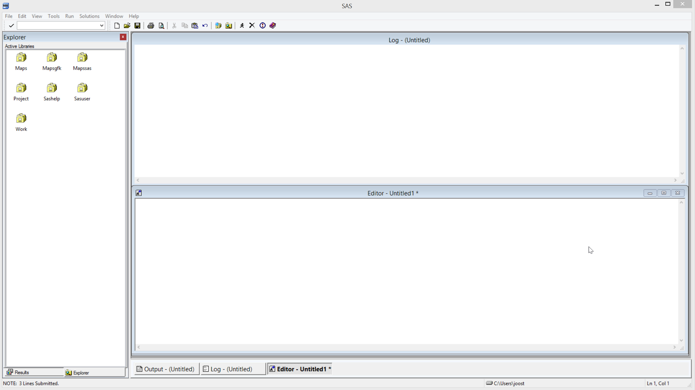

# Remote submit (rsubmit)

## Quick overview (Youtube video)

[](https://www.youtube.com/watch?v=etfcUaVD73s "SAS remote submit")

Click the image above to play the video. 

## Sign on

We can programmatically connect SAS with WRDS servers. In order to make such a connection we need SAS to tell the specifics of the connection. The following codeblock will do that (the full code is at the bottom of this page):

```SAS
/* this piece of code makes a connection of your SAS instance with WRDS remote server */
%let wrds = wrds.wharton.upenn.edu 4016;options comamid = TCP remote=WRDS;
signon username=_prompt_;
```

This will pop up a login screen. If login is successful, the log will show the available libraries. After that point, you can use `rsubmit`-`endrsubmit` code blocks which will execute on WRDS.

By the way, remote submit is not necessary if you use SAS Studio through the WRDS website (as explained [here](2_using_wrds_website)), as in that case you are already working on (and executing code on) the WRDS server. 

Note that the connection will time out after 20 minutes or so. If that is the case, `rsubmit` code will fail, and you need to run the `signon` again. In that case, the log will show:

```
NOTE: Remote submit to WRDS commencing.
ERROR: Conversation termination; status=1.
ERROR: A link must be established by executing the SIGNON command before you can communicate with
       WRDS.
ERROR: Remote submit to WRDS canceled.
NOTE: The link to WRDS has been terminated. You must SIGNON to reestablish the link.
```
### Local viewing of remote library

The following code will create an entry in the libraries (left panel), where you can navigate the remote library. In other words, you can double-click on datasets on WRDS and view these.

```SAS
Libname rwork slibref=work server=wrds;
```

## Rsubmit

'rsubmit' executes the code remotely. Always the end of the code that needs to be executed remotely with an 'endrsubmit;'.

The following code block runs on WRDS, how exciting! Take a look at the log.

```SAS
rsubmit;
%put Hi there! ;
endrsubmit;
```
## Example

The following query creates a new dataset (named 'myFunda'). It takes `comp.funda` as a starting point and filters on `TIC eq "GOOGL"`. 

There are also some boilerplate filters (that are always needed when getting data from Compustat Fundamental Annual ) `if indfmt='INDL' and datafmt='STD' and popsrc='D' and consol='C'`. This is to prevent double/wrong records.

```SAS
/* this piece of code makes a connection of your SAS instance with WRDS remote server */
%let wrds = wrds.wharton.upenn.edu 4016;options comamid = TCP remote=WRDS;
signon username=_prompt_;

/* Let's get the MTB data for Google, notice how we compute it straight in the query */
rsubmit;

data myFunda (keep = gvkey fyear chso prcc_f mtb roa);
set comp.funda;
/* filter */
where TIC eq "GOOGL";
/* this is some boilerplate filtering (gets rid of doubles) */
if indfmt='INDL' and datafmt='STD' and popsrc='D' and consol='C';
/* drop if any of these variables are missing */
if cmiss (of csho prcc_f ceq ni at) eq 0;
/* create new variables market to book ratio and return on assets */
mtb = csho * prcc_f / ceq;
roa = ib / at;
run;

proc print;run;
endrsubmit;
```

## proc download

In order to bring a remote dataset to your pc, you can use 'proc download'. 

```SAS
rsubmit;
proc download data=work.myFunda out=work.myLocalFunda;run;
endrsubmit;
```

## proc upload

To upload files to WRDS (for example to match against other datasets) use proc upload. 

Example:

```SAS
rsubmit;
proc upload data=work.myLocalDataset out=work.myRemoteDataset;run;
endrsubmit;
```

